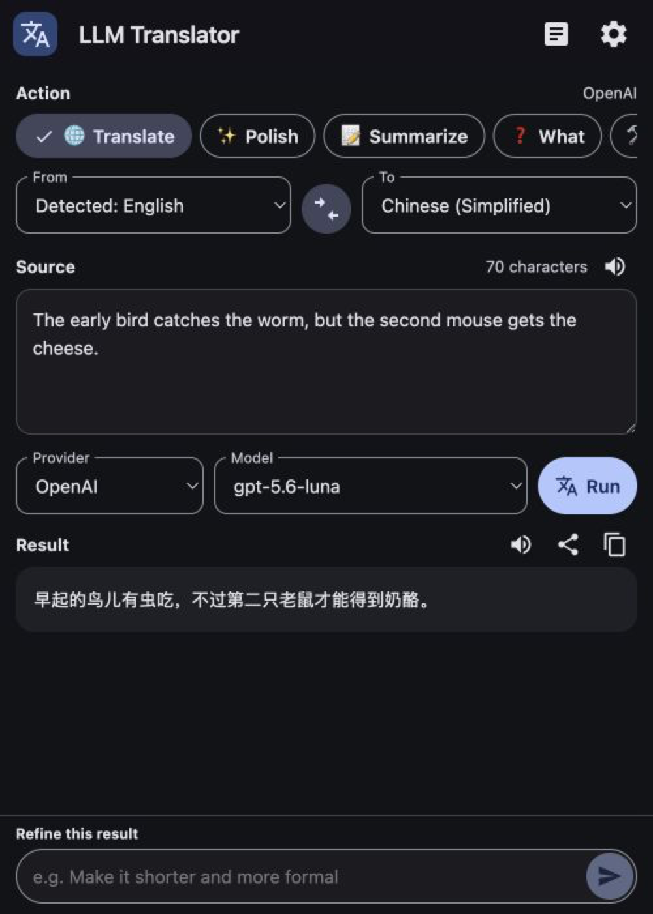
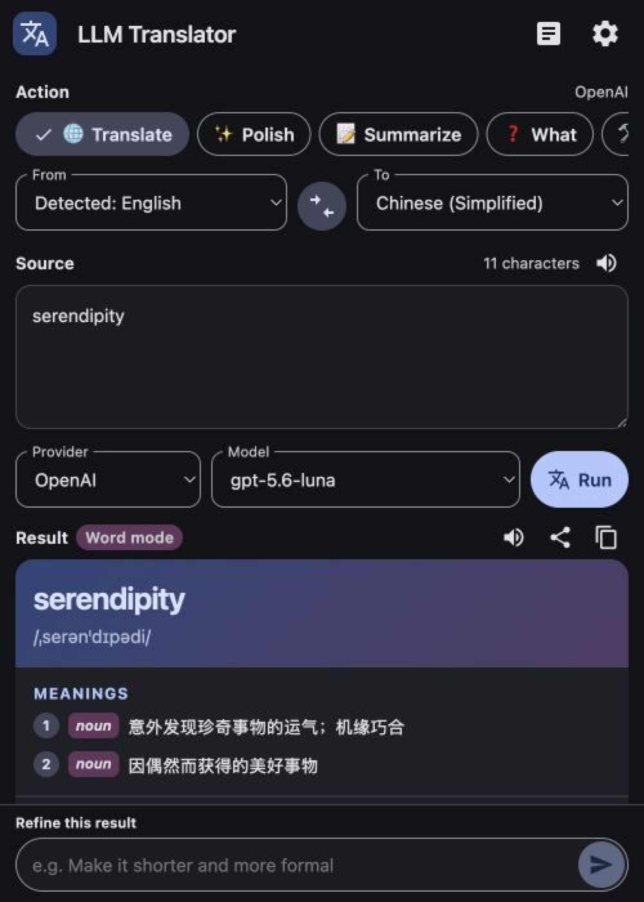
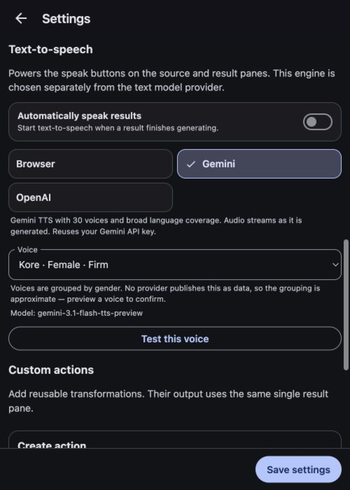
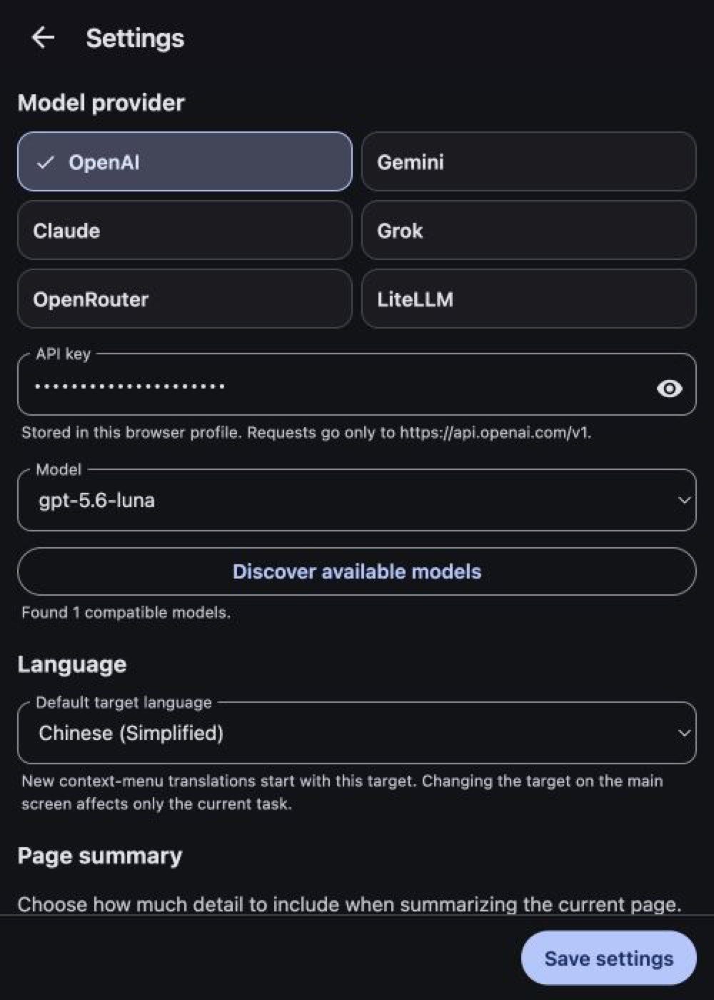

# LLM Translator

A Chrome side-panel extension that translates, rewrites and explains selected text using the model provider of your choice — OpenAI, Gemini, Claude, Grok, OpenRouter, or your own LiteLLM proxy.

Your API keys stay in your browser profile. Requests go straight from Chrome to the provider you picked; there is no backend in between.

<p align="center">
  
</p>

## Features

- **Side panel, not a popup.** Select text on any page, choose **Translate** from the context menu — or press **Alt+T** (**Option+T** on macOS) — and the panel opens beside the page instead of over it. Rebind the shortcut at `chrome://extensions/shortcuts`.
- **Six built-in actions.** Translate, Polish, Summarize, What, How, Why.
- **Summarize the current page.** Read the main webpage content in one click, choose a short, medium, or long digest, add an optional style instruction, and produce it in the selected target language.
- **Word mode.** Translating a single word returns a full dictionary entry — pronunciation, senses by part of speech, bilingual examples, and etymology — instead of a bare gloss.
- **Refine without a chat log.** Follow-up instructions like *"make it shorter and more formal"* replace the result in place. One pane, no conversation to scroll.
- **Language exchange.** Swap source and target in one click to translate a result back.
- **Custom actions.** Define your own prompts with `${text}`, `${sourceLang}` and `${targetLang}` placeholders, and optionally pin each to a specific provider and model.
- **Text-to-speech.** Read the source or the result aloud, using Chrome's built-in speech engine or a cloud voice.
- **Streaming results** and **Material Design 3** light and dark themes, following Chrome or pinned to one in Settings.

## Screenshots

| Word mode | Text-to-speech |
| --- | --- |
|  |  |

<p align="center">
  
</p>

## Install

### From a release

1. Download `llm-translator-VERSION-chrome.zip` from [Releases](https://github.com/ShinChven/llm-translator/releases) and unzip it.
2. Open `chrome://extensions` and enable **Developer mode**.
3. Choose **Load unpacked** and select the unzipped folder.

### From source

Requires Node.js 22+ and Chrome 116+.

```bash
npm install
npm run build
```

Then load the generated `dist/` directory with **Load unpacked**, as above.

## Set up a provider

Open the panel from Chrome's toolbar, go to **Settings**, pick a provider and paste an API key. **Discover available models** fills the model list from the provider's own API.

| Provider | Endpoint | Default model |
| --- | --- | --- |
| OpenAI | `api.openai.com` | `gpt-5.6-luna` |
| Gemini | `generativelanguage.googleapis.com` | `gemini-3.5-flash-lite` |
| Claude | `api.anthropic.com` | `claude-haiku-4-5` |
| Grok | `api.x.ai` | `grok-latest` |
| OpenRouter | `openrouter.ai` | `openrouter/auto` |
| LiteLLM | your own host | discovered |

The five hosted providers are locked to their official domains. LiteLLM is the only provider with a configurable Base URL, and Chrome asks for access to that host only when you save settings or discover models.

## Text-to-speech

The speech engine is chosen separately from the text model provider, so you can translate with one and listen with another.

| Engine | Needs a key | Notes |
| --- | --- | --- |
| **Browser** (default) | No | Chrome's Web Speech API. Starts instantly, works offline, uses your system voices. |
| Gemini | Gemini key | `gemini-3.1-flash-tts-preview`, 30 voices, broad language coverage. |
| OpenAI | OpenAI key | `gpt-4o-mini-tts`, 13 voices. |

Cloud engines stream audio as it is generated rather than waiting for the whole clip, and each finished clip is cached in memory, so replaying the same text costs nothing. A cloud engine is selectable only once its provider has a key.

Voices are grouped by gender to make them easier to choose between. No provider publishes gender as data, so that grouping is curated and approximate — preview a voice to confirm.

## Actions

| Action | What it does |
| --- | --- |
| Translate | Translates into the target language. A single word switches to word mode. |
| Polish | Rewrites for clarity, keeping the original language. |
| Summarize | Condenses the source. |
| What / How / Why | Explains the source, answering in the target language. |

Custom actions appear alongside these and support a role prompt, a command prompt, an output format (plain text, Markdown, LaTeX), and optional provider/model overrides.

## Privacy

- API keys are stored in `chrome.storage.local`, scoped to your browser profile.
- Source text is sent only to the provider you selected for that request.
- Generated audio is cached in memory only and is discarded when the panel closes.
- The extension requests `activeTab`, `contextMenus`, `scripting`, `sidePanel` and `storage`, plus network access to the fixed provider domains. Access to a LiteLLM host is optional and requested only when you configure one.
- `activeTab` and `scripting` read the current selection for the keyboard shortcut and the current page only when you press **Summarize current page**. `activeTab` grants temporary access after you invoke the extension, so the extension has no standing permission to read any site.

## Development

```bash
npm run dev        # rebuild on change
npm run typecheck  # tsc --noEmit
npm run build      # typecheck, then production build
```

The product specification lives in [`docs/`](./docs/README.md) — start with [functional-design.md](./docs/functional-design.md) for the requirements and [provider-architecture.md](./docs/provider-architecture.md) for how providers are wired.

## Releases

Pushing a `vMAJOR.MINOR.PATCH` tag triggers a GitHub Actions release. The workflow verifies that the tag matches `package.json`, `package-lock.json` and `public/manifest.json`, builds the extension, packages `dist/` as `llm-translator-VERSION-chrome.zip`, generates `SHA256SUMS.txt`, and publishes a GitHub Release with both assets.

```bash
npm run verify:release-tag -- v0.2.0   # check the versions agree first
git tag v0.2.0
git push origin v0.2.0
```

Prerelease tags such as `v0.3.0-beta.1` create a GitHub prerelease. `package.json` and `package-lock.json` carry the full prerelease version, while Chrome's `manifest.json` uses the numeric core version (`0.3.0`).

## Not yet implemented

The product documents also specify history, OCR, vocabulary, and rich Markdown/LaTeX rendering. Those are tracked in [`docs/`](./docs/README.md) and are deliberately separate from the processing foundation this build establishes.

## Credits

Inspired by [nextai-translator](https://github.com/nextai-translator/nextai-translator). The `nextai-translator/` directory in this repository is a reference project only; this extension is an independent implementation.

## Author

ShinChven &lt;shinchven@gmail.com&gt;

## License

[MIT](./LICENSE)
